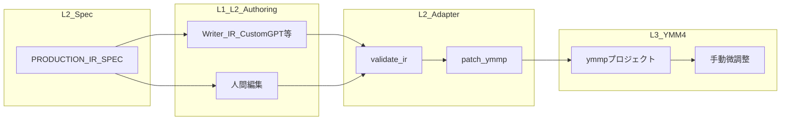

# Production IR 能力マトリクス（語彙と L2/L3 の際限）

> **正本の役割**: [PRODUCTION_IR_SPEC.md](PRODUCTION_IR_SPEC.md) にある**語彙・意味**と、`apply-production` / `patch-ymmp` が **実際に ymmp に書き込む範囲**の差を混同しないための対照表。  
> 関連: [AUTOMATION_BOUNDARY.md](AUTOMATION_BOUNDARY.md)、[OPERATOR_WORKFLOW.md](OPERATOR_WORKFLOW.md)（G-11〜G-13）、[verification/G12-timeline-route-measurement.md](verification/G12-timeline-route-measurement.md)、[samples/timeline_route_contract.json](../samples/timeline_route_contract.json)。

## 1. データの流れ（概要）

- **語彙**は仕様上すべて「意味ラベル」として定義できるが、**アダプタが書き込むのはその一部**である。  
- **G-12** は `motion` / `transition` / `bg_anim` について **readback と経路契約**まで。patch での自動書き込みとは別レイヤー。

## 2. Micro IR フィールド別マトリクス

| フィールド                    | 仕様（意味の正本）                                                                                                                                                                        | `patch_ymmp` が ymmp に反映                                            | `validate-ir` で検知                    | G-12 経路契約                                                                                                                                                                                 | L3 手動・備考                                          |
| ------------------------ | -------------------------------------------------------------------------------------------------------------------------------------------------------------------------------- | ------------------------------------------------------------------ | ------------------------------------ | ----------------------------------------------------------------------------------------------------------------------------------------------------------------------------------------- | ------------------------------------------------- |
| `template`               | [PRODUCTION_IR_SPEC.md](PRODUCTION_IR_SPEC.md) §3.1（C-07 A–D + intro/closing）。オペレータが画像例から言語化した意図は [C07-visual-pattern-operator-intent.md](C07-visual-pattern-operator-intent.md) | **いいえ**（carry-forward のみ。ymmp の型を切り替えない）                           | 語彙チェックなし                             | 対象外                                                                                                                                                                                       | 演出構成・素材選定のガイド。YMM4 上の見え方はテンプレ依存                   |
| `face`                   | 同 §3.2                                                                                                                                                                           | **はい**（face_map / palette 解決）                                      | はい（unknown / gap / drift / 連続 run 等） | 対象外                                                                                                                                                                                       | ラベルとパーツの対応は palette 整備が前提                         |
| `idle_face`              | 同 §2.1（idle_face）                                                                                                                                                                | **はい**（TachieFaceItem 挿入）                                          | はい（カバレッジ等）                           | 対象外                                                                                                                                                                                       | 同上                                                |
| `bg`（micro または macro 由来） | 同 §3.3                                                                                                                                                                           | **はい**（macro `default_bg` 中心にレイヤー0の bg を再配置）                       | macro に bg ラベルが無いと `BG_MISSING`      | `bg_anim` 系は ImageItem 経路と関連                                                                                                                                                              | ファイル解決は bg_map。動画 bg の扱いはテンプレ次第                   |
| `slot`                   | 同 §3.5                                                                                                                                                                           | **はい**（slot_map + registry、`off` は非表示）                             | はい（契約あり時 unknown / drift）            | 対象外                                                                                                                                                                                       | 座標は registry。テンプレ外レイアウトは手動                        |
| `overlay`                | 同 §3.7                                                                                                                                                                           | **はい**（`--overlay-map` 指定時、ImageItem 挿入）                           | はい（契約あり時 unknown）                    | 主に overlay 挿入設計（G-13）                                                                                                                                                                     | タイミング・見え方の最終判断は人間                                 |
| `se`                     | 同 §3.8                                                                                                                                                                           | **条件付き**（registry で解決し、write route が corpus にある場合。無い場合は fail-fast） | はい（契約あり時 unknown）                    | `AudioItem` 経路は corpus 依存（G-13）                                                                                                                                                           | `SE_WRITE_ROUTE_UNSUPPORTED` は mechanical failure |
| `bg_anim`                | 同 §3.4                                                                                                                                                                           | **はい**（セクション先頭発話の `bg_anim` → Layer0 `ImageItem` の X/Y/Zoom 線形キーフレーム。プリセット: `none` / `pan_*` / `zoom_*` / `ken_burns`） | **はい**（未知ラベルは `BG_ANIM_UNKNOWN_LABEL`） | **あり**（`ImageItem` X/Y/Zoom 等、効果付き bg の `VideoEffects` は未 patch）。契約は [G12](verification/G12-timeline-route-measurement.md) / [timeline_route_contract.json](../samples/timeline_route_contract.json) | [G-14](FEATURE_REGISTRY.md)。数値プリセットは機械的；「良さ」の微調整は YMM4 手動可  |
| `motion`                 | 同 §3.6                                                                                                                                                                           | **はい**（`--motion-map` 指定時、発話アンカーで `TachieItem` を区間分割し `VideoEffects` を適用。`none` は空配列でクリア） | **はい**（未知語彙 `MOTION_UNKNOWN_LABEL`／台帳契約時 `MOTION_MAP_UNKNOWN_LABEL`） | **あり**（`TachieItem.VideoEffects`）                                                                                                                                                         | [G-16](FEATURE_REGISTRY.md)。Phase2 では発話区間で適用（`row_range` 優先 / `index` fallback）。同一 `motion` 連続区間は結合 |
| `transition`             | 同 §3.9（機械化は **none / fade** のみ。仕様上の他語彙は validate で ERROR）                                                                                                                                                                           | **はい**（`fade` → `VoiceItem` の Voice/Jimaku フェード。`none` → 0 クリア） | **はい**（`none`/`fade` 以外は `TRANSITION_UNKNOWN_LABEL`） | **fade 系は観測済み**（G-12）。`slide`/`wipe` 等は未 patch（ERROR で止める）                                                                 | [G-15](FEATURE_REGISTRY.md)。秒数はコード定数（将来 registry 可） |

## 3. Macro IR（参考）

| 要素                                    | 仕様   | `patch_ymmp`  | `validate-ir`                | 備考                 |
| ------------------------------------- | ---- | ------------- | ---------------------------- | ------------------ |
| `sections[].default_bg`               | §2.2 | bg 再配置の入力     | `BG_MISSING` で macro 全体をチェック |                    |
| `sections[].default_face` 等           | §2.2 | micro と合わせて参照 | face 系は micro 集計で検査          |                    |
| `pattern_mix` / `visual_arc` / `tone` | §2.2 | **反映なし**      | なし                           | LLM・編集者向けの動画方針テキスト |

## 4. なぜ「背景＋表情だけ」と感じるか

現行の [ymmp_patch.py](../src/pipeline/ymmp_patch.py) では、**確実にタイムラインを書き換える**のは上表のとおり **face / idle_face / slot / bg / overlay（map 時）/ se（条件付き）/ motion（`--motion-map` 時）** である。  
`motion` は **G-16** で **`TachieItem.VideoEffects`** に反映（台帳必須・`none` はクリア）。Phase2 では発話アンカーで区間分割し、同一 motion 連続区間を結合して反映する。`transition` は **G-15** で **`none` / `fade`** のみ **VoiceItem** に反映（仕様の `slide_*` 等は **validate-ir で ERROR**）。`bg_anim` は **G-14** で **ImageItem のパン・ズーム系**に限定実装済み（`VideoEffects` 付き bg は別）。仕様書の語彙は **将来拡張と Writer 契約**のために先に広げている。

## 5. 将来拡張（台帳・契約が先）

**`bg_anim` の VideoEffects 系**や **`transition` の slide/wipe 等**を patch に載せる場合の前提例:

1. [FEATURE_REGISTRY.md](FEATURE_REGISTRY.md) で FEATURE を明記し承認する。
2. [G-12](verification/G12-timeline-route-measurement.md) の契約と矛盾しない write route を選ぶ。
3. `validate-ir` に unknown / contract miss を足し、失敗時は書き出し前に止める（G-11〜G-13 / G-14 / G-15 / G-16 と同じパターン）。

※ **G-14** により `bg_anim` の **ImageItem X/Y/Zoom プリセット**は patch 済み。効果レイヤー（`ImageItem.VideoEffects`）は別 FEATURE。  
※ **G-15** により `transition` の **fade（Voice/Jimaku）**は patch 済み。非 fade 系は別 FEATURE。  
※ **G-16** により `motion` の **`TachieItem.VideoEffects`**（`--motion-map`）は patch 済み。Phase2 で発話区間分割まで実装済み。`ShapeItem` 経路は別 FEATURE。

## 6. 関連コマンド

| コマンド                              | 役割                               |
| --------------------------------- | -------------------------------- |
| `validate-ir`                     | 上表「validate-ir」列が Yes の領域を中心にゲート |
| `apply-production` / `patch-ymmp` | 上表「patch_ymmp」が Yes の領域を書き換え     |
| `measure-timeline-routes`         | G-12 の readback・`--expect` で経路契約 |

---

*このファイルは「語彙の全集＝自動適用の全集」ではないことを示すための正本とする。*