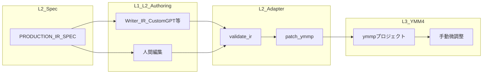
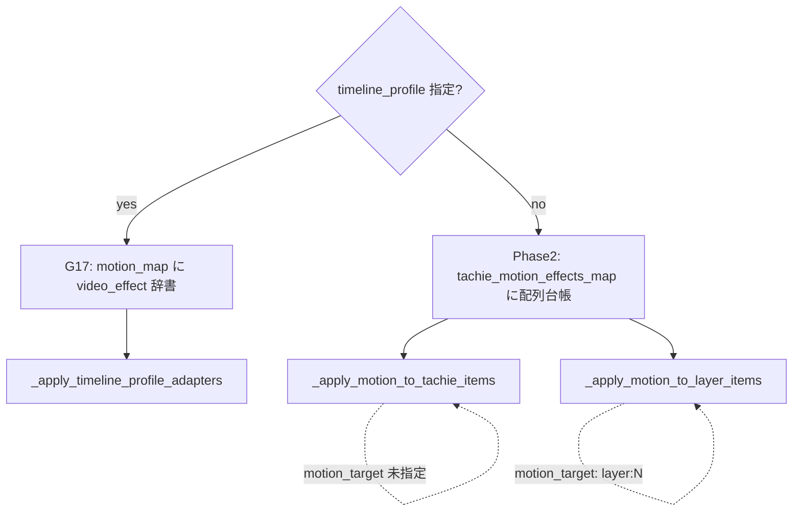

# Production IR 能力マトリクス（語彙と L2/L3 の際限）

> **正本の役割**: [PRODUCTION_IR_SPEC.md](PRODUCTION_IR_SPEC.md) にある**語彙・意味**と、`apply-production` / `patch-ymmp` が **実際に ymmp に書き込む範囲**の差を混同しないための対照表。  
> 関連: [AUTOMATION_BOUNDARY.md](AUTOMATION_BOUNDARY.md)、[OPERATOR_WORKFLOW.md](OPERATOR_WORKFLOW.md)（G-11〜G-13）、[verification/G12-timeline-route-measurement.md](verification/G12-timeline-route-measurement.md)、[samples/timeline_route_contract.json](../samples/timeline_route_contract.json)。

## 1. データの流れ（概要）




- **語彙**は仕様上すべて「意味ラベル」として定義できるが、**アダプタが書き込むのはその一部**である。  
- **G-12** は `motion` / `transition` / `bg_anim` について **readback と経路契約**まで。patch での自動書き込みとは別レイヤー。

**`motion` の分岐（実装）:**



**`motion_target` による適用先分岐**: IR に `motion_target: "layer:N"` を指定すると、`_apply_motion_to_tachie_items` はそのエントリをスキップし、`_apply_motion_to_layer_items` が該当レイヤーの `ImageItem`/`GroupItem` に VideoEffects を書き込む。未指定時は従来どおり speaker の `TachieItem` が対象。両経路は常に両方実行される（排他ではない）。

## 2. Micro IR フィールド別マトリクス


| フィールド                    | 仕様（意味の正本）                                                                                                                                                                        | `patch_ymmp` が ymmp に反映                                            | `validate-ir` で検知                    | G-12 経路契約                                                                                                                                                                                 | L3 手動・備考                                          |
| ------------------------ | -------------------------------------------------------------------------------------------------------------------------------------------------------------------------------- | ------------------------------------------------------------------ | ------------------------------------ | ----------------------------------------------------------------------------------------------------------------------------------------------------------------------------------------- | ------------------------------------------------- |
| `template`               | [PRODUCTION_IR_SPEC.md](PRODUCTION_IR_SPEC.md) §3.1（C-07 A–D + intro/closing）。オペレータが画像例から言語化した意図は [C07-visual-pattern-operator-intent.md](C07-visual-pattern-operator-intent.md) | **いいえ**（carry-forward のみ。ymmp の型を切り替えない）                           | 語彙チェックなし                             | 対象外                                                                                                                                                                                       | 演出構成・素材選定のガイド。YMM4 上の見え方はテンプレ依存                   |
| `face`                   | 同 §3.2                                                                                                                                                                           | **はい**（face_map / palette 解決）                                      | はい（unknown / gap / drift / 連続 run 等） | 対象外                                                                                                                                                                                       | ラベルとパーツの対応は palette 整備が前提                         |
| `idle_face`              | 同 §2.1（idle_face）                                                                                                                                                                | **はい**（TachieFaceItem 挿入）                                          | はい（カバレッジ等）                           | 対象外                                                                                                                                                                                       | 同上                                                |
| `body_id`                | 同 §2.1（body_id、G-19）                                                                                                                                                             | **はい**（`--face-map-bundle` 指定時、body_id に対応する face_map を選択して face/idle_face に適用） | はい（`BODY_ID_UNKNOWN` / `BODY_FACE_MAP_MISS`） | 対象外                                                                                                                                                                                       | シーンレベル (V1)。バンドルレジストリの `characters[char].default_body` がフォールバック |
| `bg`（micro または macro 由来） | 同 §3.3                                                                                                                                                                           | **はい**（macro `default_bg` 中心にレイヤー0の bg を再配置）                       | macro に bg ラベルが無いと `BG_MISSING`      | `bg_anim` 系は ImageItem 経路と関連                                                                                                                                                              | ファイル解決は bg_map。動画 bg の扱いはテンプレ次第                   |
| `slot`                   | 同 §3.5                                                                                                                                                                           | **はい**（slot_map + registry、`off` は非表示）                             | はい（契約あり時 unknown / drift）            | 対象外                                                                                                                                                                                       | 座標は registry。テンプレ外レイアウトは手動                        |
| `overlay`                | 同 §3.7                                                                                                                                                                           | **はい**（`--overlay-map` 指定時、ImageItem 挿入）                           | はい（契約あり時 unknown）                    | 主に overlay 挿入設計（G-13）                                                                                                                                                                     | タイミング・見え方の最終判断は人間                                 |
| `se`                     | 同 §3.8                                                                                                                                                                           | **はい**（`--se-map` 指定時、`AudioItem` を挿入。G-18 で write route 実装済み） | はい（契約あり時 unknown）                    | `AudioItem` 経路は G-18 readback 済み                                                                                                                                                           | タイミング・音量の最終判断は人間 |
| `bg_anim`                | 同 §3.4                                                                                                                                                                           | **はい（二経路）** **(A) キーフレーム（G-14）**: micro bg の各 Layer0 セグメントで、時間重なる発話の `bg_anim`（carry-forward 済み）を **ImageItem の X/Y/Zoom 線形キーフレーム**に反映（`none` / `pan_*` / `zoom_*` / `ken_burns`）。**`--timeline-profile` 不要。** **(B) VideoEffects（G-17）**: `--timeline-profile` + `--bg-anim-map`（ラベル → `{ video_effect: {...} }`）で、契約通過時のみ Layer0 Image/Video の **`VideoEffects` 追記**。 | **はい**（未知ラベルは `BG_ANIM_UNKNOWN_LABEL`） | **あり**（両経路とも G-12 契約と整合する readback 前提。[timeline_route_contract.json](../samples/timeline_route_contract.json)） | (A) は数値プリセットのみ。(B) はプロファイル限定。微調整は YMM4 手動可。 |
| `motion`                 | 同 §3.6                                                                                                                                                                           | **はい（三経路）** **Phase2**: `--tachie-motion-map` のみ有効化。**`--timeline-profile` を付けない**とき `_apply_motion_to_tachie_items` が動き、台帳は **VideoEffects オブジェクトの配列**（[tachie_motion_map.example.json](../samples/tachie_motion_map.example.json)）。発話アンカーで `TachieItem` を区間分割し、`none` は空配列でクリア。同一 motion の連続区間は結合。**G-17**: **`--timeline-profile` 指定時**は Phase2 ロジックは**走らず**、`_apply_timeline_profile_adapters` が **`--motion-map`**（[motion_map_g17.example.json](../samples/motion_map_g17.example.json)）で **既存 TachieItem** に `video_effect` を追記。**motion_target 経路**: IR に `motion_target: "layer:N"` を指定すると、Phase2 と同時に `_apply_motion_to_layer_items` が該当レイヤーの `ImageItem`/`GroupItem` に同じ `tachie_motion_effects_map` の VideoEffects を書き込む（TachieItem 経路はスキップ）。 | **はい**（`MOTION_UNKNOWN_LABEL`／`MOTION_MAP_UNKNOWN_LABEL`。台帳キーは `validate-ir` で `--motion-map` と `--tachie-motion-map` の**和集合**で検証可） | **あり**（`TachieItem.VideoEffects`、`motion_target` 時は `ImageItem.VideoEffects` / `GroupItem.VideoEffects`） | `motion_target` 未指定時は speaker_tachie 対象。`motion_target: "layer:N"` 指定時は背景 ImageItem 等にも適用可。 |
| `group_motion` / `group_target` | G-20（中央基準 Group テンプレ前提）                                                                                                                                                           | **はい（A案）**: `--group-motion-map` 指定時、既存 `GroupItem` を探索して `X/Y/Zoom` を更新。`group_target` 未指定時は GroupItem が 1 件の場合のみ自動解決。 | **はい**（`GROUP_MOTION_UNKNOWN_LABEL`） | **あり**（`GroupItem.X/Y/Zoom`） | **幾何補助**。茶番劇演者の主経路ではなく、template-first 運用の微調整に使う。 |
| `skit_group` template intent (`motion` + `motion_target`) | G-24（外部茶番劇演者 GroupItem template） | **はい（template source 指定時）**: `--skit-group-registry` + `--skit-group-template-source` で registry intent / fallback を解決し、repo-tracked `.ymmp` template source の GroupItem clip を対象発話 frame / layer へ挿入。配置限定時は `--skit-group-only` で face/bg 等の未解決を切り離す。2026-04-28 以後は template-analyzed placement として、GroupItem の `X` / `Y` / `Zoom` を rest pose へ正規化し、相対 delta は維持する。 | **はい**（`SKIT_GROUP_UNKNOWN_INTENT` / `SKIT_TEMPLATE_SOURCE_MISSING` / `SKIT_TEMPLATE_SOURCE_ASSET_MISSING` / `SKIT_TEMPLATE_ANALYSIS_INSUFFICIENT` / `SKIT_PLACEMENT_NO_VOICE_TIMING`） | **あり**（GroupItem + child ImageItem insertion + normalized transform readback） | 主経路。YMM4 で作った GroupItem template をコピー・正規化するだけで、Python が素材・音声・テンプレートを生成する経路ではない。 |
| `transition`             | 同 §3.9（機械化は **none / fade** のみ。仕様上の他語彙は validate で ERROR）                                                                                                                                                                           | **はい**（`fade` → `VoiceItem` の Voice/Jimaku フェード。`none` → 0 クリア） | **はい**（`none`/`fade` 以外は `TRANSITION_UNKNOWN_LABEL`） | **fade 系は観測済み**（G-12）。`slide`/`wipe` 等は未 patch（ERROR で止める）                                                                 | [G-15](FEATURE_REGISTRY.md)。秒数はコード定数（将来 registry 可） |


## 3. Macro IR（参考）


| 要素                                    | 仕様   | `patch_ymmp`  | `validate-ir`                | 備考                 |
| ------------------------------------- | ---- | ------------- | ---------------------------- | ------------------ |
| `sections[].default_bg`               | §2.2 | bg 再配置の入力     | `BG_MISSING` で macro 全体をチェック |                    |
| `sections[].default_face` 等           | §2.2 | micro と合わせて参照 | face 系は micro 集計で検査          |                    |
| `pattern_mix` / `visual_arc` / `tone` | §2.2 | **反映なし**      | なし                           | LLM・編集者向けの動画方針テキスト |


## 4. なぜ「背景＋表情だけ」と感じるか

現行の [ymmp_patch.py](../src/pipeline/ymmp_patch.py) では、**確実にタイムラインを書き換える**のは上表のとおり **face / idle_face / slot / bg / overlay（map 時）/ se（条件付き）/ motion（台帳付き）/ group_motion（A案）/ skit_group placement（template source 指定時）/ transition（G-15）/ bg_anim（上表の A または B）** である。
`motion` は **Phase2（`--tachie-motion-map`・profile 無し）** か **G-17（`--timeline-profile` + `--motion-map`）** のどちらか一方が効く（同時に両方の分割ロジックは走らない）。Phase2 使用時、IR に `motion_target: "layer:N"` を指定すると `_apply_motion_to_layer_items` が該当レイヤーの `ImageItem`/`GroupItem` にも VideoEffects を書き込む（`_apply_motion_to_tachie_items` はその IR エントリをスキップ）。`transition` は **G-15** で **`none` / `fade`** のみ **VoiceItem** に反映（仕様の `slide_*` 等は **validate-ir で ERROR**）。`bg_anim` は **G-14 のキーフレーム**と **G-17 の VideoEffects** が併存しうる。仕様書の語彙は **将来拡張と Writer 契約**のために先に広げている。

## 5. 将来拡張（台帳・契約が先）

**`transition` の slide/wipe 等**や **未契約の新経路**を patch に載せる場合の前提例:

1. [FEATURE_REGISTRY.md](FEATURE_REGISTRY.md) で FEATURE を明記し承認する。
2. [G-12](verification/G12-timeline-route-measurement.md) の契約と矛盾しない write route を選ぶ。
3. `validate-ir` に unknown / contract miss を足し、失敗時は書き出し前に止める（G-11〜G-13 / G-14 / G-15 / G-16 / G-17 と同じパターン）。

※ **G-14** により `bg_anim` の **ImageItem X/Y/Zoom プリセット**（micro bg 連動）は patch 済み。  
※ **G-17** により `bg_anim` の **`ImageItem`/`VideoItem` の `VideoEffects` 追記**（プロファイル + `bg_anim_map`）も patch 済み。  
※ **G-15** により `transition` の **fade（Voice/Jimaku）**は patch 済み。非 fade 系は別 FEATURE。  
※ **G-16 Phase2** により **`--tachie-motion-map`** で **`TachieItem` 区間分割 + VideoEffects**。`motion_target: "layer:N"` 指定時は `ImageItem`/`GroupItem` にも同様の分割 + VideoEffects を適用。**G-17** により **`--timeline-profile` + `--motion-map`** で **TachieItem への video_effect 追記**（Phase2 ロジックは無効）。`ShapeItem` 経路は別 FEATURE。

## 6. 関連コマンド


| コマンド                              | 役割                               |
| --------------------------------- | -------------------------------- |
| `validate-ir`                     | 上表「validate-ir」列が Yes の領域を中心にゲート |
| `apply-production` / `patch-ymmp` | 上表「patch_ymmp」が Yes の領域を書き換え     |
| `measure-timeline-routes`         | G-12 の readback・`--expect` で経路契約 |

### GroupMotion（A案）運用例

```bash
python -m src.cli.main validate-ir production.ir.json \
  --group-motion-map samples/group_motion_map.example.json

python -m src.cli.main patch-ymmp production.ymmp production.ir.json \
  --face-map face_map.json \
  --bg-map bg_map.json \
  --group-motion-map samples/group_motion_map.example.json \
  -o production_group_patched.ymmp
```

### GroupMotion（A案）の適用境界（現時点）

- 可能: 既存 GroupItem の `X/Y/Zoom` をラベル駆動で deterministic に書き換える（A案）。
- 不可: GroupItem の新規生成・レイヤー再配置を伴う自動グループ化（B案）。
- 前提: テンプレート側に中央基準 GroupItem が存在し、`group_target` で識別できること。
- fail-safe: `GROUP_MOTION_NO_GROUP_ITEM` / `GROUP_MOTION_TARGET_MISS` / `GROUP_MOTION_TARGET_AMBIGUOUS` はブロッキング（書き出し前に停止）。

※ 上記の「新規生成不可」は `group_motion` の境界であり、G-24 `skit_group` template placement には適用しない。G-24 は repo-tracked template source から GroupItem clip を挿入する別経路。


---

*このファイルは「語彙の全集＝自動適用の全集」ではないことを示すための正本とする。*
