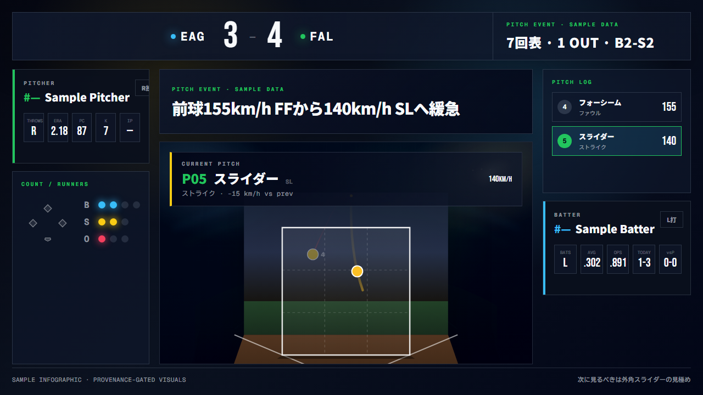
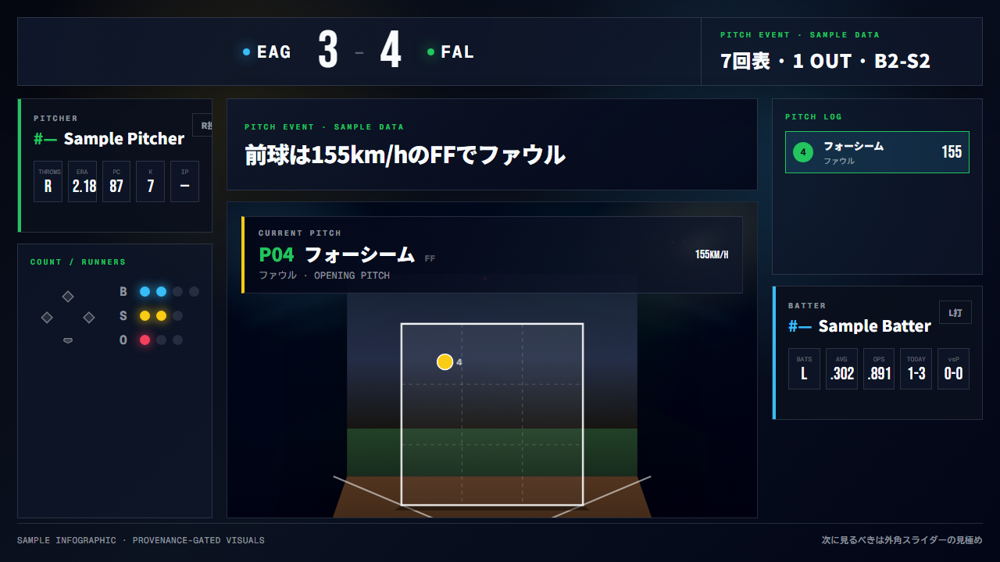
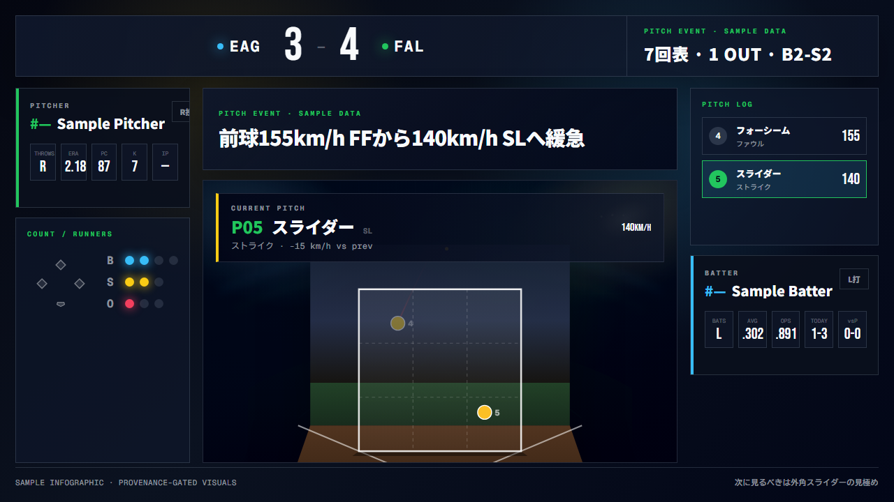
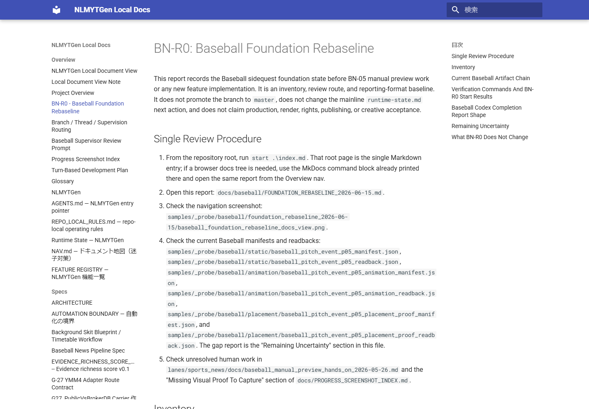
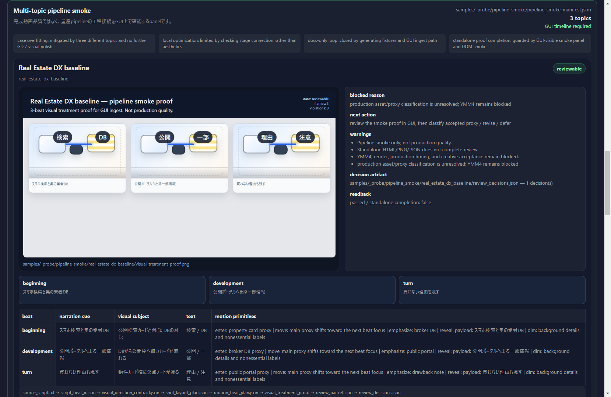
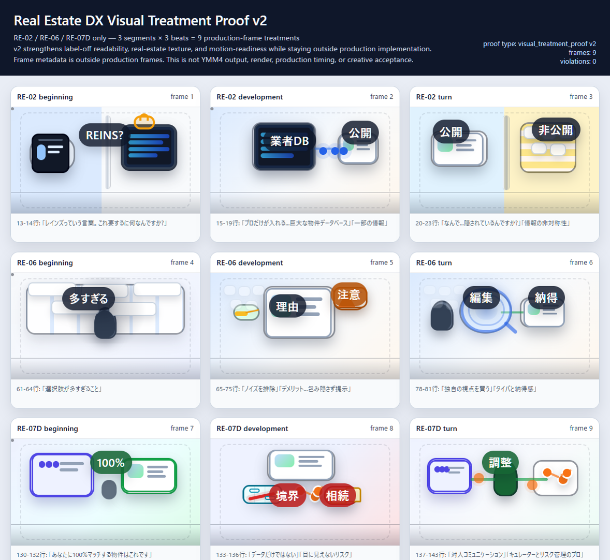
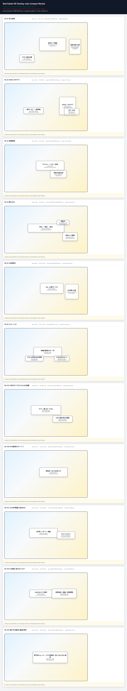

# Progress Screenshot Index

This page indexes existing visual progress assets for browser review. It is not
a replacement for the owner specs, manifests, readbacks, or handoff documents.
Do not treat a screenshot as creative acceptance unless the linked owner file
explicitly says so.

## Existing Progress Images

| View | Image path | What to inspect | Owner context | Boundary |
| --- | --- | --- | --- | --- |
| Baseball static infographic | `samples/_probe/baseball/static/baseball_pitch_event_p05.png` | One-screen pitch-event layout, score hierarchy, zone, side panels. | [baseball_infographic_backlog.md](../lanes/sports_news/docs/baseball_infographic_backlog.md), BN-03. | Static PNG export only; not YMM4 creative acceptance. |
| Baseball frame sequence | `samples/_probe/baseball/animation/frames/baseball_pitch_event_p05/` | Whether exported frames communicate the pitch update clearly. | [baseball_bn04_animation_export_design_2026-05-26.md](../lanes/sports_news/docs/baseball_bn04_animation_export_design_2026-05-26.md). | Frame sequence only; not codec clip or YMM4 placement. |
| Baseball foundation rebaseline docs view | `samples/_probe/baseball/foundation_rebaseline_2026-06-15/baseball_foundation_rebaseline_docs_view.png` | Whether the local docs view reaches the BN-R0 rebaseline report from the index/Overview route. | [FOUNDATION_REBASELINE_2026-06-15.md](baseball/FOUNDATION_REBASELINE_2026-06-15.md). | Navigation and report evidence only; not Baseball visual production proof. |
| Baseball pipeline smoke visual | `samples/_probe/pipeline_smoke/baseball_news_infographic/visual_treatment_proof.png` | Earlier smoke-style visual treatment for baseball news. | Pipeline smoke artifacts. | Visual treatment proof, not the BN-03/BN-04 owner. |
| Pipeline GUI smoke | `samples/_probe/pipeline_smoke/pipeline_smoke_gui_screenshot.png` | GUI smoke surface and operator flow. | Pipeline smoke artifacts and GUI docs. | Smoke screenshot, not a full GUI acceptance record. |
| Real Estate DX visual treatment | `samples/_probe/g24/real_estate_dx_visual_treatment_proof.png` | G-24/G-27 visual treatment direction. | G-24/G-27 verification docs. | Prior case evidence; G-27 is held and G-28 supersedes active direction. |
| Real Estate DX compact review | `samples/_probe/g24/real_estate_dx_overlay_only_compact_review_screenshot.png` | Compact review surface and overlay-only readability. | G-24/G-27 verification docs. | Diagnostic/review image, not production acceptance. |

### Baseball Static Export

### Baseball Frame Sequence Samples

### Baseball Foundation Rebaseline Docs View

### Pipeline And Prior Visual Proofs

## Screenshot Placement Rule

Keep progress screenshots beside the artifact they prove:

| Artifact family | Preferred placement | Why |
| --- | --- | --- |
| Baseball static or animation proof | `samples/_probe/baseball/<slice>/...` | Keeps PNG, manifest, readback, and review image together. |
| G-24/G-27/G-28 visual probes | `samples/_probe/g24/...` or `samples/_probe/g28/...` | Keeps diagnostic visuals close to the probe reports. |
| Pipeline smoke proof | `samples/_probe/pipeline_smoke/<case>/...` | Keeps smoke images separate from canonical specs. |
| Thumbnail samples | `samples/*thumb*.png` | These are sample outputs; they should not be promoted into docs as source truth. |

When a new screenshot is added, link it here instead of moving the source image
into `docs/`. The local MkDocs generator copies selected proof images into the
ignored `.mkdocs-docs/` staging folder so the browser view can render them.

## Missing Visual Proof To Capture

| Needed proof | Suggested path | Return signal |
| --- | --- | --- |
| BN-05 YMM4 manual preview screenshot | `samples/_probe/baseball/placement/baseball_pitch_event_p05_yymm4_preview_screenshot.png` | One screenshot from YMM4 at frame `1560` / `00:26.00`, plus `PASS` or `FIX` with the reason. |

The checklist for that manual step is
[baseball_manual_preview_hands_on_2026-05-26.md](../lanes/sports_news/docs/baseball_manual_preview_hands_on_2026-05-26.md).
