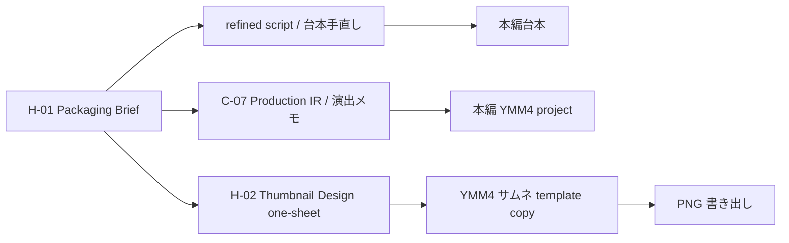

# Thumbnail Variation and IR Plan — 2026-04-28

目的: 「YMM4 テンプレを人間が複製し、文字・立ち絵・背景を差し替えて書き出す」を基本線にしたまま、毎回違ったサムネイルにするための変奏設計と、台本 / 演出 IR との接続方針を整理する。

## 結論

- サムネイルは **台本本文とも本編 Production IR とも別の成果物**として扱う。
- ただし、H-01 Packaging Brief を共通上位制約にして、台本 / 本編演出 / サムネ設計を同じ promise から分岐させる。
- LLM には C-07 と同じ入力セットで **サムネイル設計 one-sheet + machine-readable thumbnail design JSON** を出させるのが自然。同じ AI 生成タイミングで出してよいが、出力 block / 保存 artifact は分ける。
- repo 側の次スライスは画像生成ではなく、**YMM4 サムネテンプレートの slot audit / registry 化**。
- 自動化するなら「既存テンプレ内の Text / Image / Group slot を差し替える」まで。最終デザイン判断と YMM4 書き出しは人間。

## なぜ台本本文や本編 Production IR に混ぜないか

台本本文は視聴維持・説明順・会話テンポの成果物であり、サムネイルはクリック前の 1 枚絵である。サムネ用コピーや構図指示を台本本文に混ぜると、本文の自然さとサムネの訴求が互いに干渉する。

Production IR は発話単位の `row_start` / `row_end` / face / bg / overlay / skit_group など、動画タイムラインに適用するための IR である。サムネイルは 1 枚画像で、発話タイミング・音声・字幕・row-range と関係しない。

混ぜると次の問題が出る:

- 台本本文が「視聴者に話す言葉」と「制作メモ」の混合物になる。
- `validate-ir` / `apply-production` の責務が広がりすぎる。
- サムネ設計の layout / copy / color が、発話単位の Micro IR と粒度不一致になる。
- サムネ側の自由度を Production IR の語彙制約に閉じ込めてしまう。
- 「サムネを作る」ために本編 `.ymmp` patch の gate を増やすことになり、制作動線が重くなる。

したがって、関係は以下がよい。



## サムネ専用 companion JSON 案

H-02 / C-08 の自然文出力に加えて、次のような JSON を出す。これは Production IR ではなく、`thumbnail_design` という兄弟成果物。

```json
{
  "thumbnail_design_version": "0.1",
  "video_id": "p0_phase1_amazon",
  "source_brief": "H-01",
  "template_family": "number_left_character_right",
  "variant_id": "number_alert_v1",
  "main_copy": "71.4%が監視",
  "sub_copy": "秒単位で追跡される現場",
  "strongest_evidence": ["71.4%", "タイム・オフ・タスク"],
  "forbidden_overclaim_checked": true,
  "layout_family": "number_left_character_right",
  "emotion_family": "confused_vs_angry",
  "color_family": "dark_blue_red_alert",
  "copy_family": "number_fact",
  "slots": {
    "main_text": {
      "text": "71.4%が監視",
      "emphasis": ["71.4%"],
      "tone": "alert"
    },
    "sub_text": {
      "text": "秒単位で追跡される現場"
    },
    "reimu": {
      "expression": "confused",
      "placement": "right_large"
    },
    "marisa": {
      "expression": "angry",
      "placement": "right_small"
    },
    "background": {
      "label": "dark_data_ui",
      "treatment": "darken_blur"
    },
    "badge": {
      "text": "AI監視",
      "style": "red_alert"
    }
  },
  "manual_notes": [
    "スマホ縮小で main_copy が読めるかを YMM4 で確認",
    "19億ドル案は opening との距離があるため第2候補"
  ]
}
```

## 変奏軸

毎回違うサムネにするには、コピーだけでなく複数の軸を回す。

| 軸 | 変えるもの | 例 |
|---|---|---|
| `copy_family` | 訴求の型 | `number_fact` / `contrast_fact` / `case_hook` / `question_with_anchor` |
| `layout_family` | 大枠配置 | 数値左+キャラ右 / 左右対比 / 物体接写 / 中央警告 |
| `color_family` | 色の印象 | 赤黒警告 / 黄黒危険 / 青黒データ / 白赤新聞 |
| `emotion_family` | キャラ感情 | 困惑×怒り / 驚き×深刻 / 疑い×解説 |
| `evidence_surface` | 表に出す根拠 | 数字 / 固有名詞 / 象徴エピソード / 比較 |
| `text_treatment` | 文字の扱い | 1 行大文字 / 2 行分割 / 数字だけ巨大化 / バッジ化 |
| `background_treatment` | 背景処理 | 暗くする / ぼかす / データ UI 重ね / 対比分割 |
| `accent_items` | 補助記号 | 矢印 / 警告三角 / 囲み枠 / 吹き出し / スタンプ |
| `character_crop` | 立ち絵の切り取り | 顔アップ / 半身 / 片側寄せ / 左右反転 |

## YMM4 テンプレ側の slot 命名案

人間が粗配置する時点で、差し替え対象を `Remark` などで命名しておく。

| slot | 役割 | 変えたい値 |
|---|---|---|
| `thumb.text.title` | メインコピー | text, X/Y/Zoom, Color route |
| `thumb.text.sub` | サブコピー | text, X/Y/Zoom, Color route |
| `thumb.text.badge_1` | 数値 / 固有名詞バッジ | text, Color route, X/Y |
| `thumb.image.reimu` | れいむ立ち絵 | ImageItem FilePath / X/Y/Zoom |
| `thumb.image.marisa` | まりさ立ち絵 | ImageItem FilePath / X/Y/Zoom |
| `thumb.image.background` | 背景 | ImageItem FilePath, crop-like X/Y/Zoom |
| `thumb.image.accent_1` | 矢印・警告・囲み | ImageItem FilePath / X/Y/Zoom |

2026-04-28 追補: CLI 実装では `thumb.text.<id>` / `thumb.image.<id>` を正式な最小 Remark 契約にした。現 repo には実サムネ用 `.ymmp` がないため、正確な TextItem route は未確定だが、`Text` / `ItemParameter.Text`、既存 `Color` 系 route、`ImageItem.FilePath`、`X` / `Y` / `Zoom` / `Rotation` の先頭値は限定 patch できる。ShapeItem / panel / opacity / width-height はまだ対象外。

## 配置微調整ルール案

完全自動レイアウトではなく、人間の粗配置を基準にした微調整に留める。

| 条件 | 自動調整の例 | 目的 |
|---|---|---|
| main_copy が短い | `Zoom +5%`、中央寄せ | 迫力を出す |
| main_copy が長い | 2 行分割、`Zoom -5〜10%`、X 幅を広げる | 読みやすさ維持 |
| 数字を含む | 数字部分をバッジ slot へ分離 | specificity を即時視認 |
| 背景が暗い方向 | `FontColor` を白 / 黄、`StyleColor` を黒 / 赤へ | コントラスト確保 |
| 背景が明るい方向 | 背面 panel opacity を上げる | 文字を浮かせる |
| split contrast | 左右の panel / bg を色分け | 1 枚で対比を伝える |
| 同じ layout が続く | character side / color_family / copy_family のうち 2 軸を変更 | 固定テンプレ感を防ぐ |

## 開発スライス案

### Slice 1: `thumbnail_design` schema / prompt sync

- H-02 one-sheet prompt に machine-readable `thumbnail_design` JSON を追加する。
- H-01 brief の `thumbnail_controls.rotation_axes` と整合させる。
- 出力はまだ patch しない。LLM 出力の形を固定するだけ。

### Slice 2: サムネ template audit

- user が YMM4 でサムネ template copy を 1 本作る。
- slot に `thumb.text.*` / `thumb.image.*` Remark を付ける。
- repo 側 read-only CLI: `audit-thumbnail-template`（実装済み）。
- 出力: slot 一覧、item type、patchable fields、missing slot warning。

### Slice 3: 文字 / 色 / 位置の限定 patch

- template copy を入力し、`thumbnail_design` JSON を適用して別 `.ymmp` を出す。
- 初期対象は `thumb.text.title` / `thumb.text.sub` / `thumb.text.badge_1` の text・色・X/Y/Zoom と、`thumb.image.*` の FilePath・X/Y/Zoom。
- `patch-thumbnail-template` は実装済み。ただし実サムネ template readback と YMM4 visual acceptance は未完了。

### Slice 4: 画像 slot replacement

- `thumb.image.background` / `thumb.image.reimu` / `thumb.image.marisa` / `thumb.image.accent_*` の image source 差し替えは v1 patch 対象に含めた。
- asset path validation は未実装。Windows path / WSL path の差があるため、初期 v1 では存在確認を fail-fast にしていない。
- ここでも画像生成はしない。既存素材パスの差し替えだけ。

### Slice 5: variation history

- 直近 N 本の `thumbnail_design` JSON から `layout_family` / `color_family` / `copy_family` の連続を検出する。
- H-02 の rotation policy を機械的 warning にする。

## LLM へ依頼する単位

本編 IR と同じ会話で依頼してよいが、出力は分ける。

推奨:

1. H-01 brief を先に貼る。
2. 台本を貼る。
3. 必要なら台本手直しを `refined_script` として出させる。
4. C-07 には本編用の Part 1 / Part 2 / Part 3 を出させる。
5. 同じ constraints から、H-02 として `thumbnail_design` companion JSON block を別レーンで出させる。
6. repo 側は当面 `thumbnail_design` を `apply-production` に渡さない。

避ける:

- 台本本文の途中にサムネ用コピー / 配置メモを混ぜる。
- Micro IR の各発話にサムネ用フィールドを入れる。
- LLM にピクセル座標や絶対パスを出させる。
- 自動生成画像を前提にする。
- `pass` / `needs_fix` のスコアだけで creative judgement を代替する。

## 次の実務判断

最初に必要なのは、コードではなく **サムネ YMM4 テンプレの slot contract**。

最低限、user 側で 1 つのサムネ template copy に以下を入れてもらえれば、repo 側は readback 設計へ進める。

- メインコピー枠
- サブコピー枠
- 数値 / 固有名詞バッジ枠
- 背景画像枠
- れいむ / まりさ立ち絵枠
- 任意の accent 枠
- 各 item / group の `Remark` に `thumb.*` 名前

その後に、assistant 側は `audit-thumbnail-template` → 限定 patch の順で進めるのが安全。
