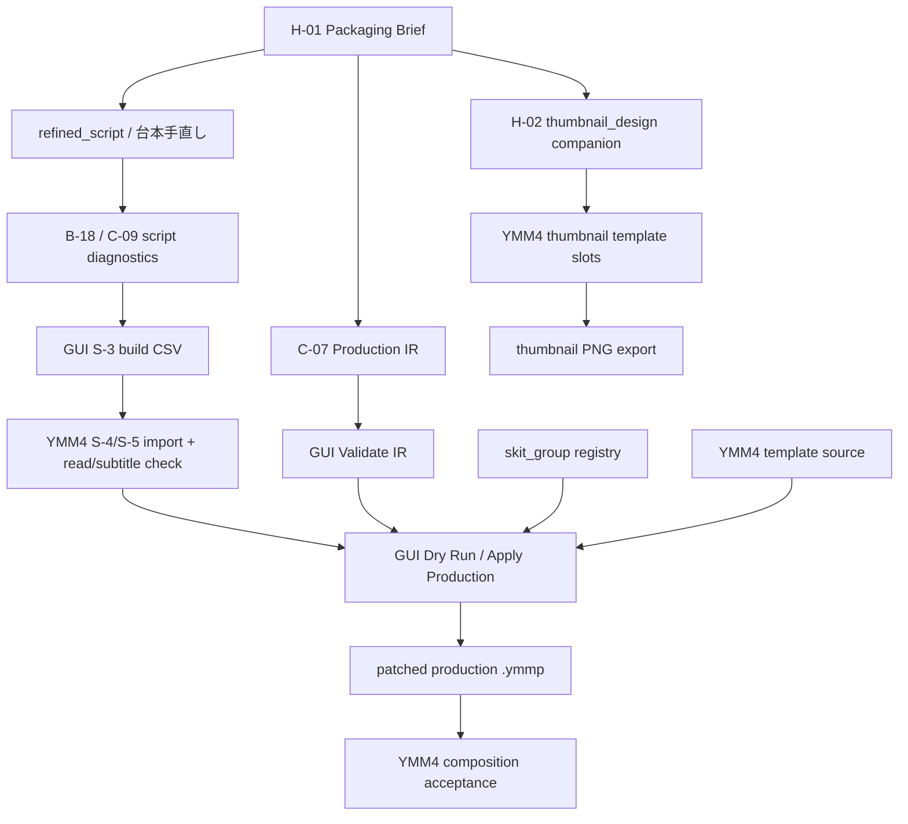

# User Workflow Rewiring Audit — 2026-04-28

目的: GUI が整ってきた一方で制作工程がまだ長く、さらに YMM4 タイムライン上の「演出作成」が実制作・開発・研究で混線しやすくなっているため、現行の並行プランを制作ワークフロー観点で再配線する。

この監査は、ユーザー文中の「以下のプラン」が本メッセージには未貼付だったため、repo-local の現在状態から確認できる並行軸を対象にする。追加プランが提示された場合は、本書 §2 / §6 に追記して統合する。

## 1. 結論

- 現在の詰まりは「GUI ボタン不足」単体ではなく、**制作成果・開発検証・研究探索が同じ YMM4 タイムライン語彙で語られていること**にある。
- G-24 は主軸として正しいが、出口は「新しい小演出を増やす」ではなく、**GUI から既存テンプレートを production `.ymmp` へ自動配置し、YMM4 で composition acceptance を一度取ること**。
- B-17 / YMM4 改行ギャップはメンテ軸であり、G-24 visual acceptance と同じセッションへ押し込まない。実害が見えた行だけ paired evidence を取る。
- サムネイルは台本本文にも本編 Production IR にも混ぜない。H-01 を上位制約にし、H-02 / `thumbnail_design` companion JSON と YMM4 サムネ template slot 契約へ分ける。同じ AI 生成タイミングで出してよいが、artifact は分ける。
- 次の最小実装候補は、演出機能を増やすことではなく、**制作セッション manifest / handoff sheet** で S-3 → S-4/S-5 → S-6b → YMM4 acceptance の成果物・ログ・未解決を束ねること。

## 2. 現在走っている並行軸

| 軸 | 位置づけ | 現状 | 次にやること | 混ぜてはいけないこと |
|---|---|---|---|---|
| G-24 skit_group template-first | 主軸 | v1 テンプレ 5 件、repo-tracked source、analyzed placement、GUI 接続まで到達 | GUI から real-estate DX など 1 本に適用し、YMM4 visual acceptance を取る | 新 motion 量産、YMM4 手置きでの埋め合わせ |
| B-17 字幕 / YMM4 幅ギャップ | メンテ | GUI 既定値は `2 / 40` に同期済み。YMM4 実表示 cap は未校正 | 実害が出た行だけ `build-csv --stats` と YMM4 表示を対に記録 | G-24 受入と同時に大量採寸すること |
| B-18 / C-09 台本品質 | メンテ / 前段品質 | NLM 台本は low-trust。診断・refinement 導線あり | 新台本の CSV / IR 前に診断 JSON を残す | 台本品質問題を S-6 の演出で吸収しようとすること |
| H-01/H-02/H-05 サムネ | 並行補助 | 判断支援・手動採点まで。サムネ `.ymmp` slot source は未存在 | YMM4 サムネ template slot audit へ進む準備 | 台本本文や Production IR micro entries にサムネ設計を混ぜること |
| G-22 / overlay_render | hold 補助経路 | skit_group 主軸ではないが一枚絵補助には有効 | skit_group で吸収できない concrete gap 時だけ使う | 茶番劇演者の主経路へ戻すこと |
| E-01/E-02 投稿 | hold | 制作パイプと分離中 | 方針変更まで触らない | S-3〜S-6 のボトルネック解消と混同すること |

## 3. 「YMM4 タイムライン上の演出作成」の分解

同じ「演出作成」という言葉に、少なくとも 4 つの作業が混ざっていた。

| 名称 | 何を作るか | owner | 成果物 | 合格条件 |
|---|---|---|---|---|
| 実制作 placement | 既存テンプレを対象発話へ配置 | assistant/tool + user acceptance | patched production `.ymmp` | readback が通り、YMM4 上の composition が許容 |
| 開発 template authoring | 少数の reusable YMM4 native template | user + assistant | template source `.ymmp` / registry | body+face が同期し、`TachieItem` 混入なし |
| 開発 adapter hardening | IR / registry / template source を安全に接続 | assistant | CLI/GUI/failure class/tests | missing / unknown / drift を書き出し前に止める |
| 研究 route probe | 未知の YMM4 route を測る | assistant | verification / contract / atlas | readback と failure class が明文化される |

混線していた点:

- **machine readback と creative acceptance の取り違え**: GroupItem 挿入は制作成果の必要条件だが、画面上の間隔・タイミングの受入とは別。
- **`motion` の二重意味**: speaker_tachie の direct write と、skit_group の template intent が同名フィールドにいるため、`motion_target: "layer:9"` と strict registry が必要。
- **手置き packet と自動配置の混同**: operator 手順票は補助になり得るが、G-24 の主軸は `template source → registry → analyzed placement → patched .ymmp`。
- **研究結果の production 直投入**: 未測定 route や `panic_shake` を本番 IR 語彙へ入れると、production が research の失敗を背負う。

## 4. 推奨する三レーン分離

### Production Lane

目的は動画を進めること。GUI 標準入口を使い、CLI 前提を増やさない。

1. S-3: GUI CSV 変換。標準は `Max Lines=2` / `Chars/Line=40` / reflow v2 / balance-lines。
2. S-4/S-5: YMM4 台本読込、読み・字幕の目視確認。ここは GUI 外。
3. S-6a: H-01 / 台本 / constraints から Production IR を得る。
4. S-6b: GUI 演出適用タブで Validate IR → Dry Run → Apply Production。
5. G-24 使用時: registry / template source / strict intent ON。`skit_group-only` は切り分け時だけ。
6. S-6c/S-7: YMM4 で patched `.ymmp` を開き、composition acceptance と通し確認。

Production Lane で止めるべきもの:

- unknown skit_group intent
- missing template source
- template analysis insufficient
- row-range / face / bg / slot の mechanical failure

Production Lane でやらないもの:

- 新テンプレート制作
- 未知 route の探索
- サムネ template slot の研究
- B-17 幅キャリブレーションの大量採寸

### Development Lane

目的は承認済み frontier を短くすること。現在は G-24 / B-17 残差 / H 系の GUI 接続が対象。

- G-24: acceptance NG 時は、まず source template facts / normalized rest pose / inserted Frame/Layer/readback を見る。
- B-17: optional `single_char_tail` stats や YMM4 cap calibration は、実害ログが溜まってから小さく起票する。
- H-05 GUI 化: useful だが、現台帳は CLI のみなので実装前に FEATURE_REGISTRY のスコープ更新が必要。
- Session manifest: 既存成果物を束ねるだけなら、新しい演出語彙や境界変更なしで効果が出やすい。

### Research Lane

目的は「採用」ではなく「境界を確定すること」。

- 未測定 timeline route
- TextItem / ShapeItem を含むサムネ `.ymmp` readback
- `panic_shake` など既存 v1 / alias で吸収できない acting
- G-22 / overlay_render の補助利用条件

Research の出力は proof / atlas / failure class であり、Production の手順票ではない。

## 5. 再配線後の全体図

制作時の読み替えは [WORKFLOW.md](../WORKFLOW.md) の「1本制作の工程表」を正本にする。下図は、その工程表を Production Lane / Development Lane / Research Lane の混線防止として眺めた概念図であり、追加の自動化仕様ではない。

## 6. 次の実装候補

### Candidate A: Production Session Manifest

最短でワークフローを短くする候補。GUI / CLI の各出力を束ねる JSON / Markdown を作る。

含める項目:

- source script path
- CSV path / build options / stats summary
- script diagnostics path
- base production `.ymmp`
- IR JSON path
- registry / map / template source paths
- validate result summary
- dry-run summary
- patched `.ymmp` path
- unresolved failure classes
- YMM4 manual acceptance result slot

効果:

- 「どこまで終わったか」を毎回探さなくてよい。
- 実制作と開発検証を同じ artifact 上で混ぜずに済む。
- YMM4 acceptance の結果を次の assistant block が拾いやすい。

### Candidate B: G-24 Acceptance Checklist in GUI

Apply 結果に、readback と creative acceptance の違いを明示する。

- readback: GroupItems inserted, missing assets, Frame/Layer/Remark
- human check: spacing, overlap, timing, scene dominance
- NG next: source template facts / placement normalization を確認、manual hand placement へ逃げない

### Candidate C: B-17 Tail Risk Stats

`build-csv --stats` / GUI stats に one-character tail risk を追加する。

- 実装は小さい可能性がある。
- ただし YMM4 実 cap が未校正なので、表示は「risk」であり「実害」ではない。
- 先に real corpus の paired evidence を 1〜2 件だけ足すと誤検知扱いを避けやすい。

### Candidate D: Thumbnail Template Slot Audit

user が YMM4 サムネ template `.ymmp` に `thumb.*` Remark を付けた後に開始する。

- read-only audit first
- TextItem / ImageItem / GroupItem の patchable fields を固定
- Production IR ではなく `thumbnail_design` companion JSON を入力にする

## 7. 今すぐの推奨順

1. **G-24 production acceptance**: 現在の analyzed placement artifact を YMM4 で一度見る。NG なら template source / analyzer 側へ戻す。
2. **Session manifest 設計**: 成果物とログを一枚に束ね、GUI の長い工程を「次に何をするか」へ圧縮する。
3. **B-17 paired evidence**: 実害が見えた行だけ記録。大量採寸しない。
4. **thumbnail slot contract**: サムネ template source が用意できたら research lane で audit。
5. **H-05 GUI / B-17 stats / thumbnail patch**: 台帳スコープを確認してから小さく実装。

## 8. 判断ルール

- 実制作で exact / fallback があるものは、まず既存テンプレートで進める。
- unknown label は「手で置けばよい」にせず、strict validation / manual note / new-template candidate へ分ける。
- research は production `.ymmp` に直接混ぜない。
- YMM4 visual proof は repeated proof にしない。初回 E2E / frontier acceptance / 最終制作物に絞る。
- user に聞く前に、repo-local artifact / readback / registry / template source で説明できるか確認する。

## 9. サムネ以外の曖昧性整理

サムネイル workflow は別担当に委任済みとして、本編制作側だけを追加監査した。

整理した曖昧性:

- **C-07 v4 の出力境界**: 本編 Production IR 専用に戻し、サムネイルコピー / `thumbnail_design` / サムネ用 `.ymmp` 配置指示を出さない扱いへ整理した。
- **IR 語彙 vs adapter 書込み vs GUI 露出**: `PRODUCTION_IR_CAPABILITY_MATRIX.md` を正本に、語彙があること、ymmp に書けること、GUI から入力できることを分けた。
- **古い timeline 能力記述**: `motion` / `transition` / `bg_anim` / `overlay` / `se` を未反映扱いにする古い文言を、G-15〜G-18 / G-24 の現在能力へ同期した。
- **B-11/B-17 の位置づけ**: B-11 は現在主軸 frontier ではなく、B-18 / C-09 / B-17 系のメンテ観測として扱う。
- **YMM4 確認境界**: G-24 compact review は creative acceptance であり、dry-run/readback で閉じられる機械確認を人間へ戻すものではない。

意図的に残した未解決:

- GUI の overlay/se/motion/timeline-profile/map 類の入力欄は未実装。production で必須化した場合は、CLI 標準化ではなく GUI 補完として別スライス化する。
- non-fade transition、未知 route、任意 item direct effect write は引き続き research / future FEATURE 扱い。
