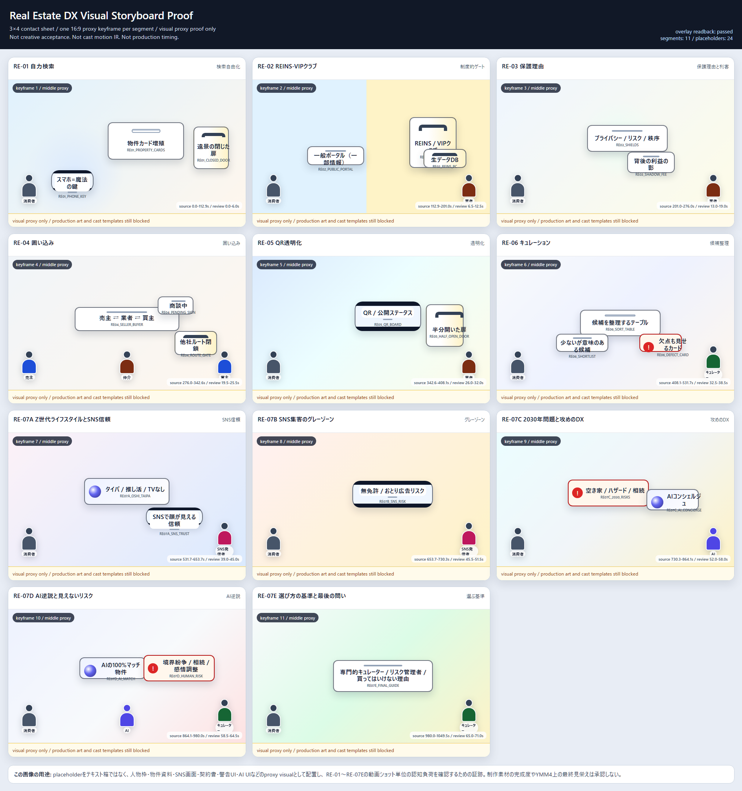
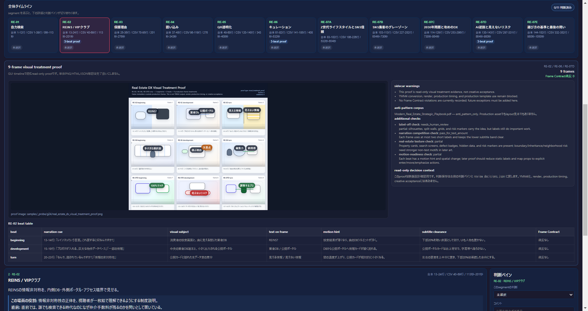
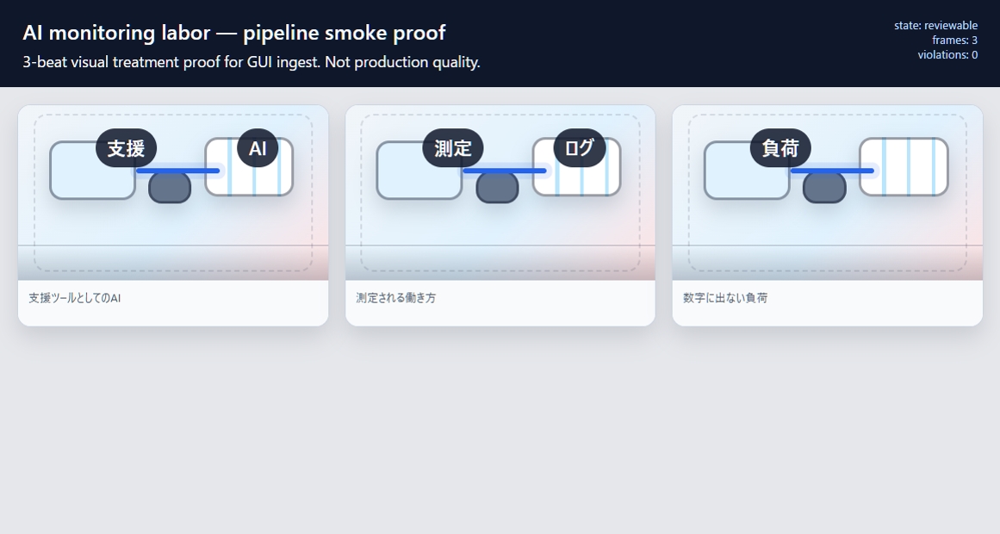
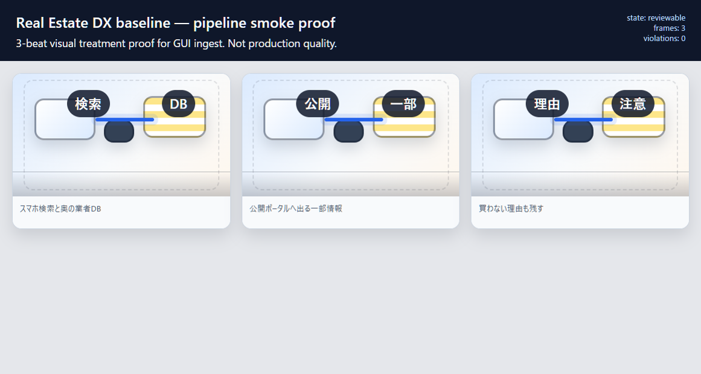
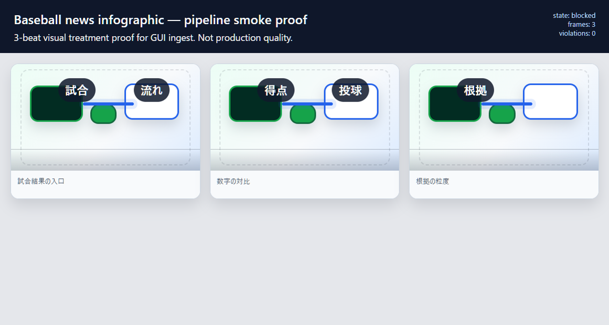
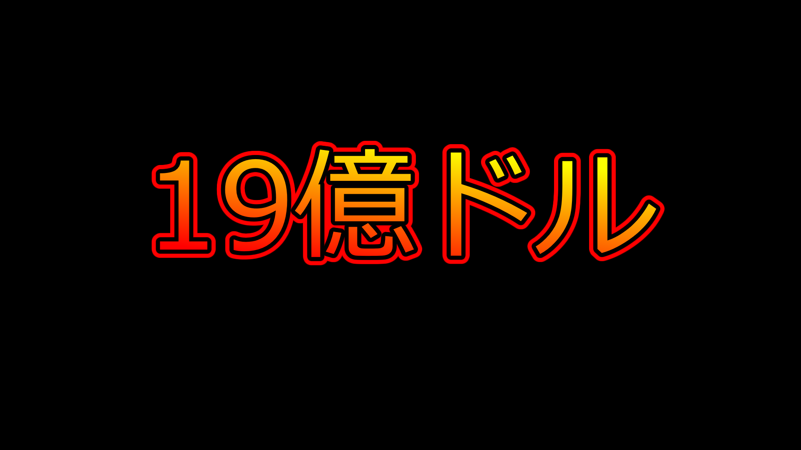

# Visual Proof Index

このページは、進捗を目視で即確認するためのローカル閲覧用索引です。画像・HTML は proof / review surface であり、仕様本文の代替ではありません。Python で画像生成・動画レンダリングを行う方針ではないことも変わりません。

## まず見る候補

| 目的 | 画像 / HTML | 正本・補足 |
| --- | --- | --- |
| G-28 reference layout prototype の入口 | [reference_layout_prototypes/index.html](../samples/_probe/g28/reference_layout_prototypes/index.html) | [G28 reference layout prototype pack](verification/G28-REFERENCE-LAYOUT-PROTOTYPE-PACK-2026-06-11.md) |
| G-28 object preset catalog | [object_catalog.html](../samples/_probe/g28/reference_layout_prototypes/object_catalog.html) | [G28 layout preset object catalog](verification/G28-LAYOUT-PRESET-OBJECT-CATALOG-2026-06-11.md) |
| G-27 compact review screenshot |  | [G27 review console spec](G27_REVIEW_CONSOLE_SPEC.md) |
| G-27 visual storyboard proof |  | [G27 review console spec](G27_REVIEW_CONSOLE_SPEC.md) |
| G-27 visual treatment proof |  | [G27 review console spec](G27_REVIEW_CONSOLE_SPEC.md) |
| GUI treatment ingest screenshot |  | [G27 review console spec](G27_REVIEW_CONSOLE_SPEC.md) |

## Pipeline smoke

| 対象 | 画像 / HTML |
| --- | --- |
| Pipeline smoke GUI |  |
| AI monitoring labor visual treatment |  |
| Real estate DX baseline visual treatment |  |
| Baseball news infographic visual treatment |  |

## Thumbnail proof anchors

これらは YMM4/user 側の書き出し proof として扱います。自動生成画像の恒久方針ではありません。

| Anchor | Image |
| --- | --- |
| P0 phase 1 Amazon |  |
| One-pass thumbnail |  |
| R3 thumbnail record |  |
| T4 keep v4 |  |
| Latest recorded v14 anchor |  |

## 見つけ方

| 探すもの | 置き場 |
| --- | --- |
| G-24 / G-27 visual proof | `samples/_probe/g24/` |
| G-28 HTML prototypes | `samples/_probe/g28/` |
| smoke proof | `samples/_probe/pipeline_smoke/` |
| thumbnail proof PNG | `samples/` root の `*thumb*.png` など |

MkDocs の一時ミラーには、`samples/_probe/**/*.png`、`samples/_probe/**/*.html`、`samples/*.png` だけをコピーします。`samples/Mat` などの大量素材は閲覧ビューへは含めません。
